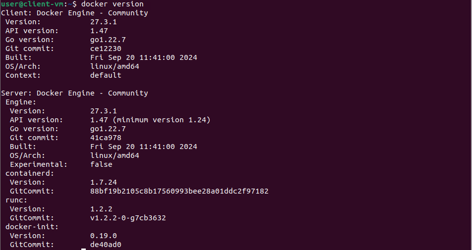
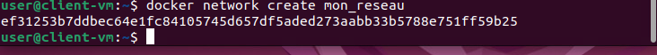
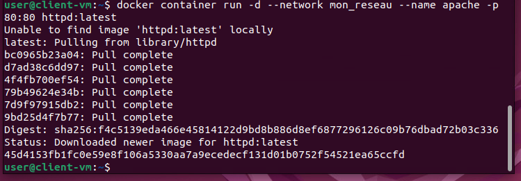
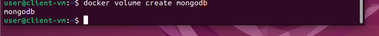
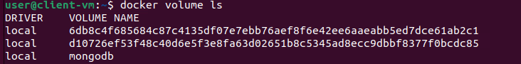
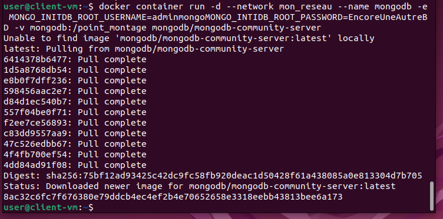

# Travail pratique 2 - Prise en main de conteneurs Docker

## Informations de remise  
Nom : Jonathan Patenaude-Daigneault 

Date de remise : 2024-12-20

## Cette procédure à pour but de créer un conteneur Apache et un autre MongoDB ainsi qu'un réseau virtuel pour les reliés entre eux.

Pour ce travail un poste client Ubuntu 22.04.5 LTS est utilisé sur un VM provenant de vSphere. Cette VM possède 2 CPU , une mémoire vivde de 8Go , 2 disques dur de 25Go chacun monté en provisionnement dynamique

## Vérification des composantes Docker
D'abord nous allons vérifier que Docker Engine et Docker Client son bien installés sur notre poste à l'aide de la commande suivante dans votre terminal : 

``` bash
   docker version
```




## Création des conteneurs sur le poste local

### D'abord il faut creer notre réseau local nommer : mon_reseau avec la commande suivante : 

``` bash
   docker network create mon_reseau
```



### Pour créer le conteneur Apache , entrer la commande suivante : 

``` bash
   docker container run -d --network mon_reseau --name apache -p 80:80 httpd:latest
```

### Description des options 

   -d :
   
    pour détacher le container du terminal 

   --network mon_reseau :
   
    pour utiliser le reseau local creer plutôt

   --name apache : 

    pour nommer le conteneur

   -p 80:80 

    pour que le conteneur écoute et diffuse sur le pour 80

   httpd:latest 

    l'image qui sera télécharge via docker 



### Création du volume de MongoDB
Entrer la commande suivante : 

``` bash
   docker volume create mongpodb
```




Pour valider la cération du volume entrer cette commande : 

``` bash
   docker volume ls
```



### Création du conteneur MongoDB 
   Entrer la commande suivante : 

``` bash
   docker container run -d --network mon_reseau --name apache -p 80:80 httpd:latest
```

### Description des options 

   -d :
   
    pour détacher le container du terminal 

   --network mon_reseau :
   
    pour utiliser le reseau local creer plutôt

   --name mongodb : 

    pour nommer le conteneur

   -e MONGO_INITDB_ROOT_USERNAME=adminmongo

    pour initialisé le nom d'administrateur 

   -e MONGO_INITDB_ROOT_PASSWORD=EncoreUneAutreBD

    pour initialisé le nom d'administrateur 

   -v mongodb:/point_montage 

    poour associé le volume que nous avons créer plutôt

   mongodb/mongodb-community-server

    l'image qui sera télécharge via docker 




