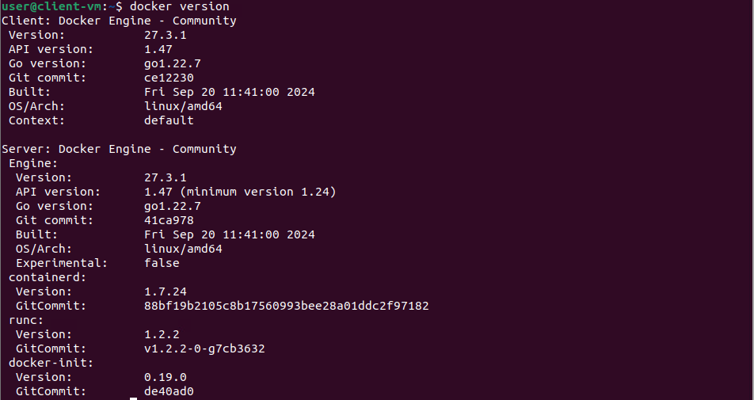

# Travail pratique 2 - Prise en main de conteneurs Docker

## Informations de remise  
Nom : Jonathan Patenaude-Daigneault 

Date de remise : 2024-12-20

## Cette procédure à pour but de créer un conteneur Apache et un autre MongoDB ainsi qu'un réseau virtuel pour les reliés entre eux.

Pour ce travail un poste client Ubuntu 22.04.5 LTS est utilisé sur un VM provenant de vSphere. Cette VM possède 2 CPU , une mémoire vivde de 8Go , 2 disques dur de 25Go chacun monté en provisionnement dynamique

## Vérification des composantes Docker
D'abord nous allons vérifier que Docker Engine et Docker Client son bien installés sur notre poste à l'aide de la commande suivante dans votre terminal : 

``` bash
   docker version
```




