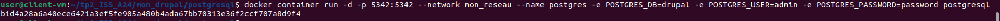

## Construction personalisée d'une image 

### D'abord creer l'aborescence de répertoires et fichiers suivant : 


### Ensuite créer un Dockerfile dans le répertoire : drupal 


### Explication du contenu du Dockerfile <

Spécification de l'image de base qui sera téléchargée via Docker :

    FROM drupal 

Instalation d'un git dans le conteneur drupal et effacement de tous les dossiers et fichiers apt 

    RUN apt-get update && \
    apt-get install -y git && \
    rm -rf /var/lib/apt/lists/* ;

Changement de dossier du travail actif pour la suite des commandes exécutables du Dockerfile

    WORKDIR /var/www/html/themes

Téléchargement du thème bootstrap et changement de droits de propriétés 

RUN git clone --branch 5.0.x --single-branch --depth 1 https://git.drupalcode.org/project/bootstrap.git && \
    chown -R www-data:www-data bootstrap

Changement de dossier du travail actif pour la suite des commandes exécutables du Dockerfile


    WORKDIR /var/www/html

Création des volumes drupal provenant de Docker

    VOLUME [ "drupal-modules:/var/www/html/modules", \
	         "drupal-profiles:/var/www/html/profiles", \
	         "drupal-sites:/var/www/html/sites", \
	         "drupal-themes:/var/www/html/themes " ]

Pour que le conteneur écoute le port 80

    EXPOSE 80


### Création du Dockerfile dans le répertoire postgres

### Explication du contenu du Dockerfile 


Spécification de l'image de base qui sera téléchargée via Docker :

    FROM postgres

Création d'un volume pour le service Postgres 

    VOLUME [ "drupal-data:/var/lib/postgresql/data" ]

Pour exposer le port 5342 (port par default pour PostGreSQL)

EXPOSE 5432


### Construction des images personalisées

Nous devons ensuite construire les conteneurs à partir des images que nous venons de personalisé, pour drupal nous allons entrer la commande suivante : 

``` bash
    docker build -t drupal .
```


Même type de commande pour Postgres

``` bash
    docker build -t postgres .
```

### Lancement des conteneur et configuration Web pour http://localhost:8080

Voici la commande pour lancer le conteneur Drupal

``` bash
    docker container run -d -p 8080:80 --network mon_reseau --name drupal_2 \
	-e POSTGRES_DB=drupal \
	-e POSTGRES_USER=user \
	-e POSTGRES_PASSWORD=pass \
    -e POSTGRES_HOST=postgres \
    drupal
```

### Explication des options de la commande 

Exposition du port 8080 à l'écoute du port 80

    -p 8080:80

POur que le conteneur soit sur le réseau local 

    -network mon_reseau


Nommer le contenur 

    --name drupal_2

Configuration des variables d'environnements pour l'utilisation de la bade de données Postgres

	-e POSTGRES_DB=drupal 
	-e POSTGRES_USER=user 
	-e POSTGRES_PASSWORD=pass 
    -e POSTGRES_HOST=postgres

Finalement le nom de l'image a lancer 

    drupal


Nous allons entrer le même type de commande pour lancer le conteneur Postgres

``` bash
    docker container run -d -p 5342:5342 --network mon_reseau --name postgres \
	-e POSTGRES_DB=drupal \
	-e POSTGRES_USER=user \
	-e POSTGRES_PASSWORD=pass \
    postgresql
```



### Vérification des conteneurs et validation de la connexion sur localhost

Pour s'assurer que les conteneur son bien configurer , entrer les commandes suivantes 

``` bash
    docker inspect drupal_2
    docker inspect postgresql
```

Nous pouvons voir les 4 volumes créer à partir du dockerfile 


Les variables d'environnements que nous avons configurés 


Le réseau local 


Et finalement le volume créer pour postgres


Validation de la connectivité via localhost:8080


